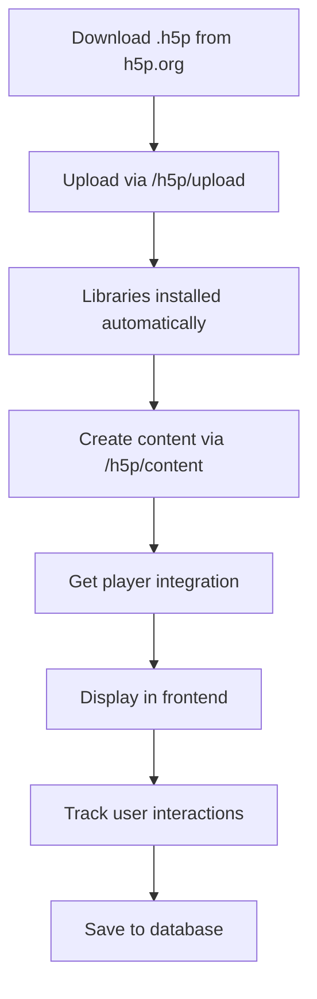

# H5P Setup và Testing Guide

## 📋 Tổng quan

Hướng dẫn này giúp bạn thiết lập và sử dụng H5P (HTML5 Package) trong hệ thống ebook reader.

## 🚀 Bước 1: Cài đặt Dependencies

```bash
cd backendd
npm install adm-zip
```

## 📁 Bước 2: Khởi tạo Database

Chạy migration để tạo các bảng H5P:

```bash
npx prisma migrate dev
```

## 📦 Bước 3: Tải H5P Libraries

Có 2 cách để cài đặt H5P libraries:

### Cách 1: Upload file .h5p (Khuyên dùng)

1. Tải sample H5P content từ: https://h5p.org/content-types-and-applications
2. Upload qua API:

```bash
POST http://localhost:3001/h5p/upload
Content-Type: multipart/form-data
Authorization: Bearer YOUR_JWT_TOKEN

file: [Chọn file .h5p]
```

**Các H5P content types phổ biến:**
- Interactive Video: https://h5p.org/interactive-video
- Course Presentation: https://h5p.org/presentation
- Quiz (Question Set): https://h5p.org/question-set
- Dialog Cards: https://h5p.org/dialog-cards
- Drag and Drop: https://h5p.org/drag-and-drop
- Timeline: https://h5p.org/timeline
- Memory Game: https://h5p.org/memory-game

### Cách 2: Download từ H5P.org

1. Truy cập https://h5p.org/content-types-and-applications
2. Click vào content type bạn muốn
3. Click "Download" để tải file .h5p
4. Upload qua endpoint `/h5p/upload`

## 🧪 Bước 4: Testing với Postman

### 1. Import Postman Collection

File: `backendd/postman-collection.json`

### 2. Setup Environment Variables

File: `backendd/h5p-test-environment.json`

Hoặc tạo manual:
```json
{
  "baseUrl": "http://localhost:3001",
  "accessToken": "YOUR_JWT_TOKEN",
  "h5pContentId": "",
  "fileId": ""
}
```

### 3. Authentication

Trước tiên, đăng nhập để lấy JWT token:

```bash
POST {{baseUrl}}/auth/login
Content-Type: application/json

{
  "email": "teacher@example.com",
  "password": "password123"
}
```

Copy `accessToken` từ response và dán vào environment variable.

### 4. Test H5P Workflow

#### A. Upload H5P Package
```bash
POST {{baseUrl}}/h5p/upload
Authorization: Bearer {{accessToken}}
Content-Type: multipart/form-data

file: [chọn file .h5p]
```

#### B. Get Package Info (trước khi upload)
```bash
POST {{baseUrl}}/h5p/package-info
Authorization: Bearer {{accessToken}}
Content-Type: multipart/form-data

file: [chọn file .h5p]
```

#### C. List Installed Libraries
```bash
GET {{baseUrl}}/h5p/libraries
Authorization: Bearer {{accessToken}}
```

#### D. Get Content Types
```bash
GET {{baseUrl}}/h5p/content-types
Authorization: Bearer {{accessToken}}
```

#### E. Create Content
```bash
POST {{baseUrl}}/h5p/content
Authorization: Bearer {{accessToken}}
Content-Type: application/json

{
  "title": "My First H5P Content",
  "library": "H5P.InteractiveVideo 1.0",
  "params": {
    "video": {
      "files": [
        {
          "path": "https://example.com/video.mp4",
          "mime": "video/mp4"
        }
      ]
    },
    "interactions": []
  }
}
```

#### F. Get Content for Playing
```bash
GET {{baseUrl}}/h5p/content/:contentId
Authorization: Bearer {{accessToken}}
```

#### G. Get Player Integration
```bash
GET {{baseUrl}}/h5p/player/:contentId
Authorization: Bearer {{accessToken}}
```

#### H. Export Content
```bash
GET {{baseUrl}}/h5p/export/:contentId
Authorization: Bearer {{accessToken}}
```

## 📝 Bước 5: Kiểm tra H5P Service Status

```bash
GET {{baseUrl}}/h5p/health
```

Response mẫu:
```json
{
  "success": true,
  "data": {
    "status": "healthy",
    "service": "H5P Service",
    "ready": true,
    "timestamp": "2025-10-03T10:00:00.000Z"
  }
}
```

## 🔧 Troubleshooting

### Lỗi: "No H5P libraries installed yet"

**Nguyên nhân:** Chưa cài đặt H5P libraries

**Giải pháp:**
1. Download file .h5p từ h5p.org
2. Upload qua `/h5p/upload` endpoint
3. Kiểm tra lại với `/h5p/libraries`

### Lỗi: "Invalid H5P package"

**Nguyên nhân:** File .h5p không đúng format

**Giải pháp:**
1. Kiểm tra file có extension .h5p
2. Tải lại từ nguồn chính thức (h5p.org)
3. Sử dụng `/h5p/package-info` để validate trước

### Lỗi: "Library not found"

**Nguyên nhân:** Content yêu cầu library chưa được cài đặt

**Giải pháp:**
1. Upload package chứa library đó
2. Hoặc upload content từ package có sẵn library

### Lỗi: "Content storage not ready"

**Nguyên nhân:** Database chưa được migrate

**Giải pháp:**
```bash
npx prisma migrate dev
npx prisma generate
```

## 📚 H5P Content Types cần cài đặt

### Essential (Cơ bản)
- ✅ **H5P.InteractiveVideo** - Video tương tác với câu hỏi
- ✅ **H5P.CoursePresentation** - Slide trình chiếu tương tác
- ✅ **H5P.QuestionSet** - Bộ câu hỏi trắc nghiệm

### Popular (Phổ biến)
- ⭐ **H5P.DragQuestion** - Kéo thả câu trả lời
- ⭐ **H5P.Blanks** - Điền từ vào chỗ trống
- ⭐ **H5P.MultiChoice** - Câu hỏi nhiều lựa chọn
- ⭐ **H5P.TrueFalse** - Câu hỏi đúng/sai

### Advanced (Nâng cao)
- 🚀 **H5P.Timeline** - Dòng thời gian tương tác
- 🚀 **H5P.MemoryGame** - Trò chơi lật thẻ
- 🚀 **H5P.Dialogcards** - Thẻ hội thoại
- 🚀 **H5P.ImageHotspots** - Hình ảnh với điểm nóng

## 🎯 Workflow đầy đủ



## 🔐 Permissions

### TEACHER / ADMIN
- ✅ Upload H5P packages
- ✅ Create content
- ✅ Edit content
- ✅ Delete content
- ✅ Export content
- ✅ Manage libraries

### STUDENT
- ✅ View content
- ✅ Interact with content
- ✅ Submit answers
- ❌ Cannot create/edit/delete

## 📊 Database Schema

### H5PContent
```prisma
model H5PContent {
  id         String   @id @default(cuid())
  title      String
  library    String   // e.g., "H5P.InteractiveVideo 1.0"
  params     Json     // Content parameters
  metadata   Json?    // Additional metadata
  uploaderId String
  isPublic   Boolean  @default(false)
  createdAt  DateTime @default(now())
  updatedAt  DateTime @updatedAt
}
```

### H5PLibrary
```prisma
model H5PLibrary {
  id              String @id @default(cuid())
  machineName     String
  majorVersion    Int
  minorVersion    Int
  patchVersion    Int
  title           String
  libraryJson     Json
  semanticsJson   Json?
  files           Json?
  dependencies    Json?
}
```

### H5PTemporaryFile
```prisma
model H5PTemporaryFile {
  id        String   @id @default(cuid())
  filename  String
  path      String
  size      BigInt
  userId    String
  expiresAt DateTime
}
```

## 🎨 Frontend Integration (Next Steps)

### 1. Install H5P Player
```bash
cd frontend
npm install h5p-standalone
```

### 2. Create H5P Player Component
```typescript
import { H5P } from 'h5p-standalone';

const H5PPlayer = ({ contentId }) => {
  useEffect(() => {
    const h5p = new H5P(document.getElementById('h5p-container'), {
      h5pJsonPath: `/h5p/content/${contentId}`,
      frameJs: '/h5p/core/js/h5p-standalone-frame.min.js',
      frameCss: '/h5p/core/styles/h5p.css',
    });
  }, [contentId]);

  return <div id="h5p-container"></div>;
};
```

## 📞 Support

Nếu gặp vấn đề:
1. Kiểm tra logs trong console
2. Test với Postman collection
3. Xem file `H5P_DATA_FLOW_EXPLANATION.md` để hiểu luồng xử lý
4. Xem file `API_DOCUMENTATION.md` để biết chi tiết API

## 🔗 Useful Links

- H5P Official: https://h5p.org
- H5P Examples: https://h5p.org/content-types-and-applications
- Lumi Education (H5P Libraries): https://github.com/Lumieducation
- H5P Documentation: https://h5p.org/documentation
